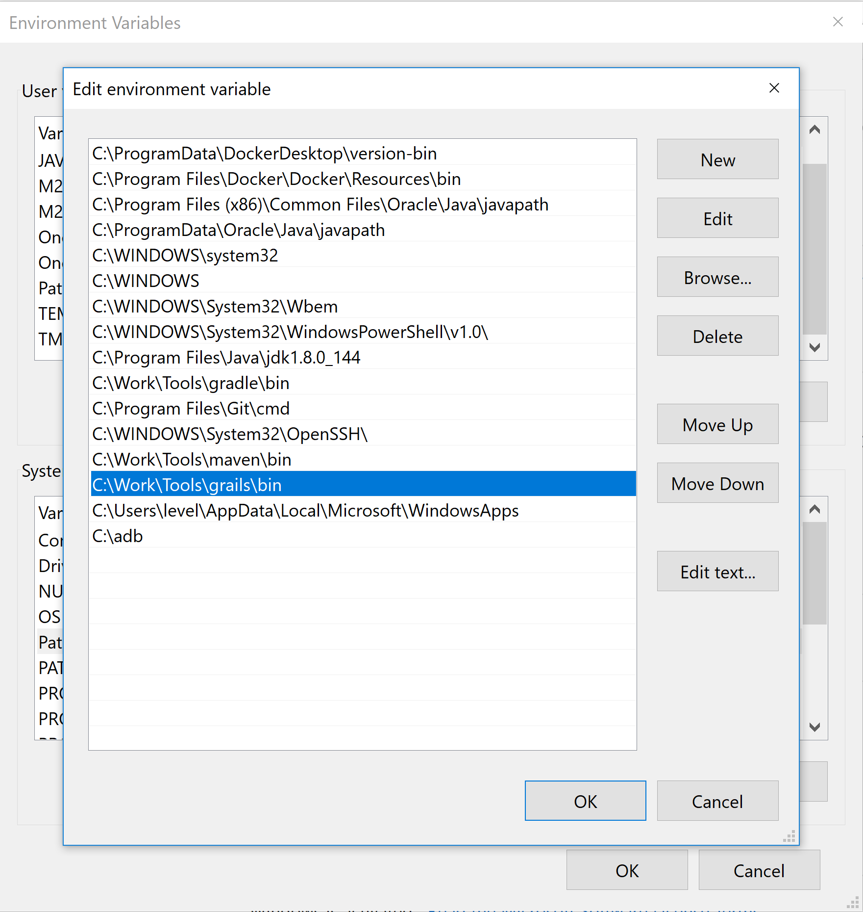
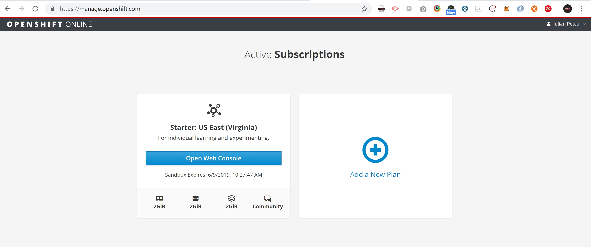
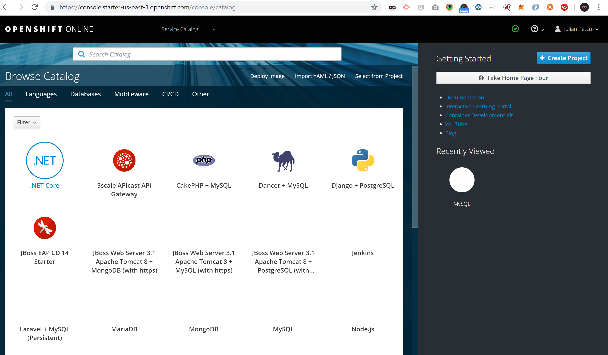

[[setting-up-tools]]
== Setting Up Tools

In this Lab we will look at how to install the necessary tools for this course.

*Installing Tools*

After completing this section, you should be able to:

* Have all tools installed properly in order for the first project to run.

* Note: This setup designed for `windows 10` machines.

*Locating the binaries or executables*

* Java: https://www.oracle.com/technetwork/java/javase/downloads/index.html - version 1.8 and 10 (verified)
    ** Install Java with default.
* Grails: https://grails.org/download.html - version 4.0.0M2 or R1 (verified)
    ** Please download the latest zip file.
    ** Don't do anything with it yet.
* IntelliJ Ultimate: https://www.jetbrains.com/idea/download/#section=windows (for Grails support)
    ** Install IntelliJ with default ( + associate groovy, kt file types )
* Docker: https://hub.docker.com/editions/community/docker-ce-desktop-windows (please register)
    ** Install Docker with default.
* OpenShift: https://www.openshift.com/trial/ (please sign up and create a sandbox)
    ** 30 minutes sandbox - https://learn.openshift.com/introduction/getting-started/  (for thoes of you that haven't registered)

*Environment Variables:*

Some tools will require more attention for them to work:

1.  *OSX and Linux:*
+
Should be easy for you to install the mentioned tools :)
2.  *Windows:*
+
2.1. Java and Grails

- Java - http://bfy.tw/NKCo (windows is at the bottom).
    ** Add `system variables` -> `path` with the location of java on your hard drive + `/bin`.
- Grails - unzip and put it in a location for `tools`, now in the same environment variables screen as for above `java` add your location under `system variables` -> `path`, below picture only as reference:

*OpenShift:*

- OpenShift activate subscription:

*Note:* your subscription will be queued for activation - hit refresh or wait for the mail to arrive, it may take some time.

- Browse to console:

*CLI tools check versions*

- Open a command prompt `WinKey+R` + type `cmd`.
- If any of below commands outputs other then the versions installed please review the steps.

[source,shell]
----
$ java -version
$ grails -version
$ docker -version
----

*Troubleshooting*

`Docker` - right click on `docker tray icon` and select `settings`:

- Expose daemon:
    ** Expose daemon on `tcp://localhost:2375 without TLS`.
- Memory issues:
    ** If you have less than `2GB Ram` available for Docker please lower the memory usage.
- Hibernate:
    ** Please note that when using any database operations the specific class has to be annotated with `@Transactional` - `import grails.gorm.transactions.Transactional`

- OpenShift memory issue:
    ** First thing after your project is created - lower the mem usage.
    ** Since OpenShift lacks of resources we need to boot the app using less than `1Gb` of memory so please do right after you create the project.

[shell, groovy]
----
bootRun {
    jvmArgs(
            '-Dspring.output.ansi.enabled=always',
            '-noverify',
            '-XX:TieredStopAtLevel=1',
            '-Xmx512m')
    sourceResources sourceSets.main
    String springProfilesActive = 'spring.profiles.active'
    systemProperty springProfilesActive, System.getProperty(springProfilesActive)
}
----

link:1-Create-New-Project.adoc[Next Lab: Create New Project] | link:0-Readme.adoc[Table Of Contents]
