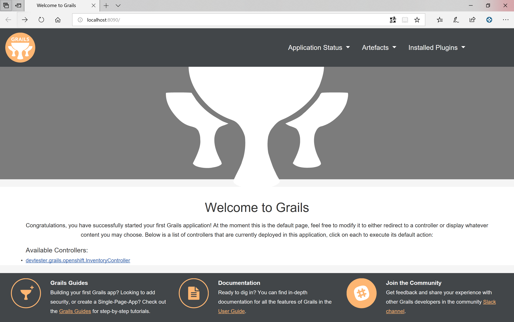
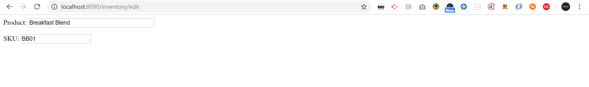

[[create-mvc]]
=== Create MVC

In this Lab we will look at how create a Model-View-Controller and access the model.

*Step 1: Creating a Controller*

After completing this section, have your application in Full-Stack:

*Controller* can work without a *View* or *Model* and that's the place where the business logic will be found.

- Right Click on `grails-app`
- Select `New` -> `Grails Controller` -> Name `Inventory`

Console:
----
|Created grails-app/controllers/devtester/grails/openshift/InventoryController.groovy
|Created src/test/groovy/devtester/grails/openshift/InventoryControllerSpec.groovy
----

*Note:* you can observe the test class that was generated for this controller `InventoryControllerSpec.groovy`

Add logic to controller and Run application.

- Within your `InventoryController.groovy`

[source,groovy]
----
class InventoryController {

    def index() {
        render "Here is a list of everything."
    }
}
----

- Run the application and you should see your first available controller:

*Note:* you can also browse directly - http://localhost:8080/inventory/index

- Every method is an `action` - index will be the default action so you can type `http://localhost:8080/inventory/`
- Now let's create a new action - `remove`

[source,groovy]
----
class InventoryController {

    //Action 1
    def index() {
        render "Here is a list of everything."
    }

    //Action 2
    def remove() {
        render "You have one less than before."
    }
}
----

*Step 2: Creating a View*

- First step is to create an action:

[source,groovy]
----
class InventoryController {

    //Action 1
    def index() {
        render "Here is a list of everything."
    }

    //Action 2 - for creating the View
    def edit() {
        //variables
        def productName = "Breakfast Blend"
        def sku = "BB01"

        //map - key in the view and value is the variable
        [product:productName, sku:sku]
    }

    //Action 3
    def remove() {
        render "You have one less than before."
    }
}
----

- Open `grails-app` -> `views`
- Right Click on `inventory`
- Select `New` -> `GSP` -> Name `edit`

*Note:* the view has to have the same name as the action that you defined, in our case `edit`.

[source,html]
----
<%@ page contentType="text/html;charset=UTF-8" %>
<html>
<head>
    <title></title>
</head>

<body>

</body>
</html>
----

- Now let's populate the `view` with data from the `edit controller`

*Note:* using the `map-keys` in order to display the data.

[source,html]
----
<%@ page contentType="text/html;charset=UTF-8" %>
<html>
<head>
    <title>Edit Inventory</title>
</head>

<body>

<form>
    Product: <input type="text" size=40 name="product" value="${product}"/>

    
SKU: <input type="text" name="sku" value="${sku}"/>

</form>

</body>
</html>
----

- Browse to the `/edit` and voila

link:0_Readme.adoc[Table Of Contents]