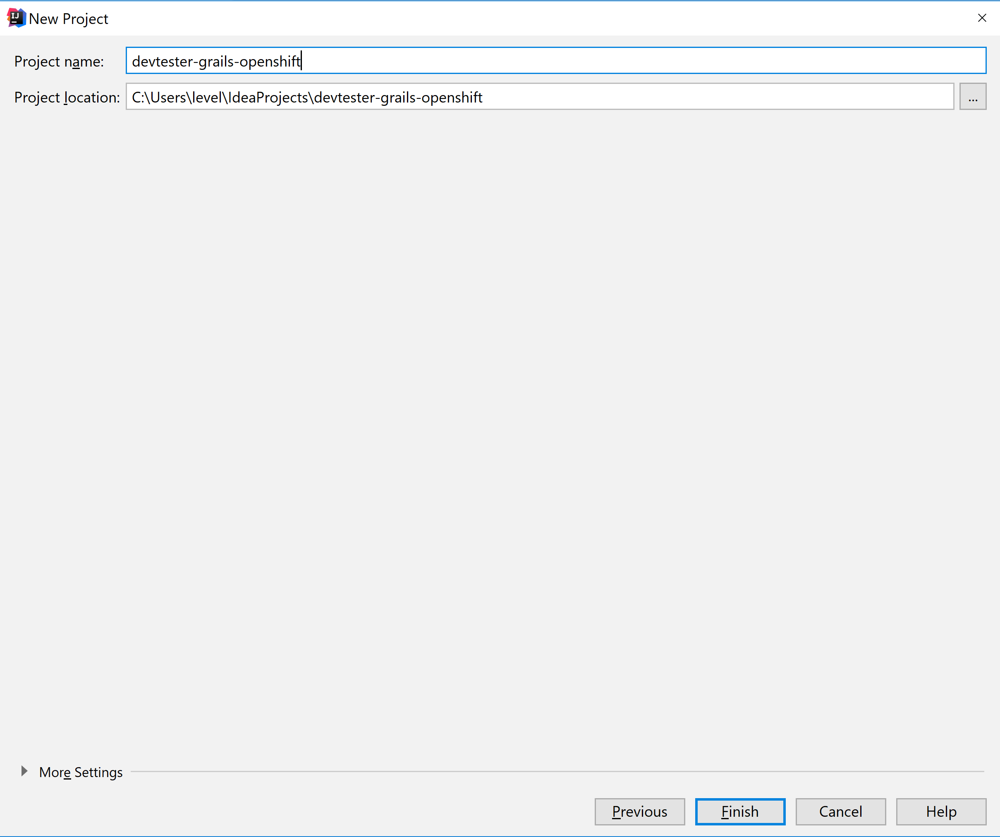
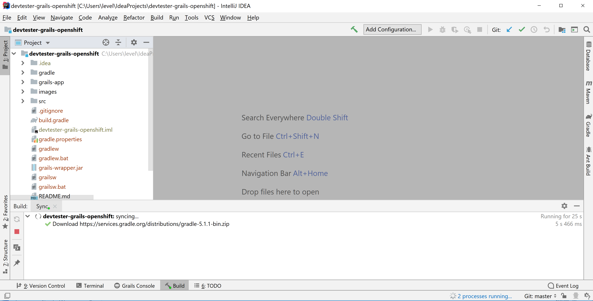
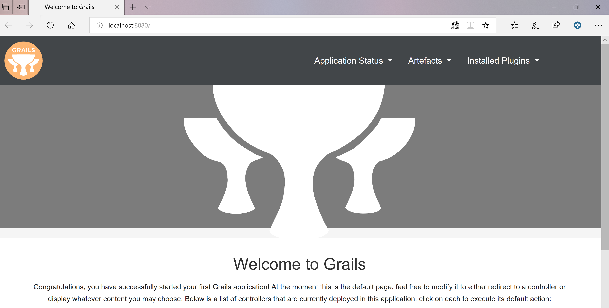

[[create-new-project]]
=== Create new project

In this Lab we will look at how create a new project.

*New base project*

After completing this section, you should be able to:

* Have your first grails app running on your machine.

*Start IntelliJ*

1. Click on `Create new Project`.
2. Select `Grails` and now browse to the location where you have unzipped the grails files.

image::images/new-project.PNG[image]

3. Give your project a name e.g. : `devtester-grails-openshift`.

4. In ~ 5 minutes your project should be setup.

*Run application*

- Press `Play/Run` button or hit `Shift+F10`.
- Wait for the application to load or start a browser on `http://localhost:8080`.

*Troubleshooting*

- Change default port:
    ** Hit `Ctrl+Shift+N` and type `application.yaml`.
    ** Scroll to the bottom and add:

        server:
            port: 8090

    ** Hit `Play/Run` and see that the app starts on the new assigned port.

link:0_Readme.adoc[Table Of Contents]