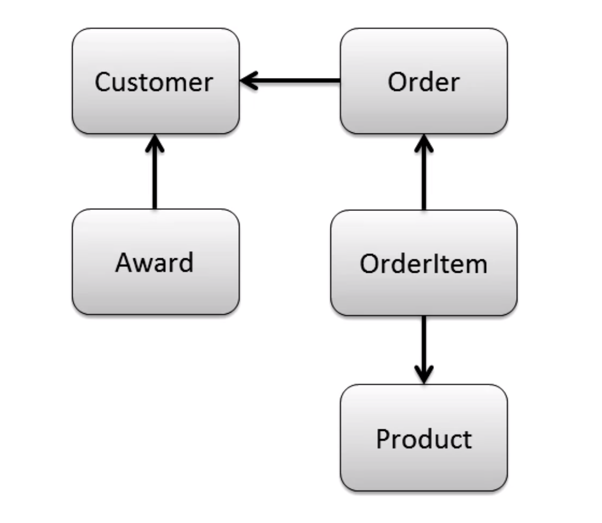
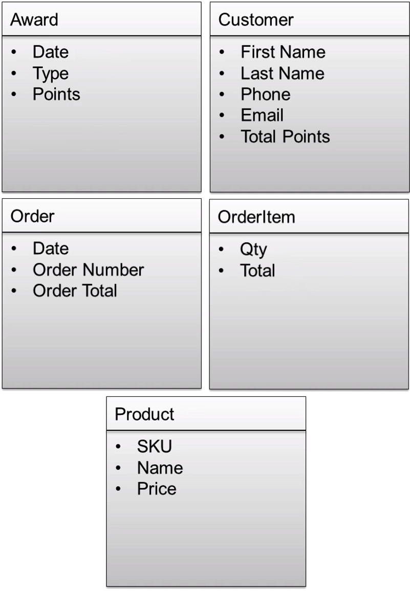
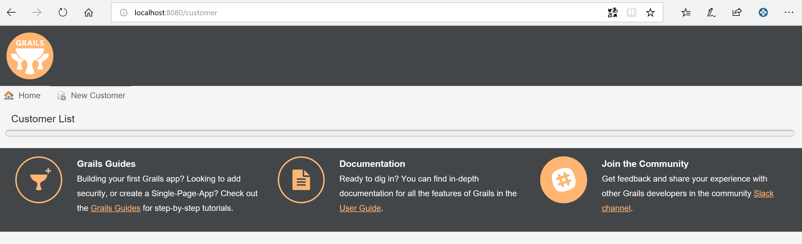
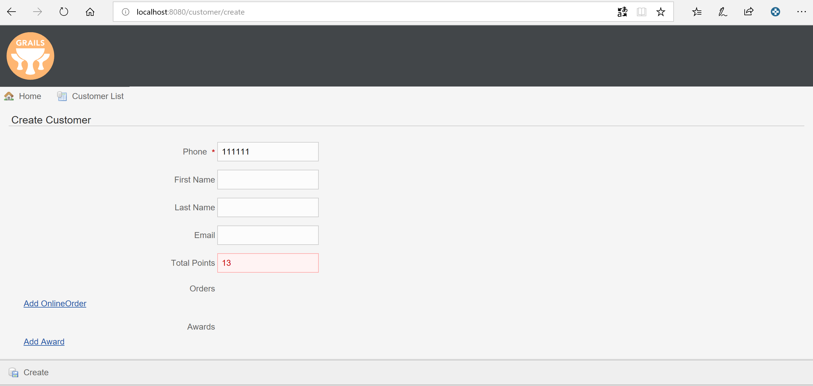

[[create-mvc]]
=== Design Data Layer

In this Lab we will look at how design our Data Layer.

*Step 1: Use Cases*

We need to understand what our application does so the best way is to have some use cases:

- Use Case #1: When a `customer` orders a beverage they receive an `award`.
- Use Case #2: A customer can go `online` an place an `order`.
- Use Case #3: An online order can contain many `items`.
- Use Case #4: You purchase a `product` in each order item.

Now that we have established our use cases this is the database relationship:

- One to many relationship - e.g - a Customer can create many Orders
- Many to many - e.g Order to Product since both are a child of OrderItem

Explain the domains that need to be created:

*Domains:*

*Step 1: Create Domain Classes*

- Open `grails-app` -> `domains`
- Right Click on `domains`
- Select `New` -> `Grails Domain Class` -> Name `Customer` / `Award` / `Order` / `OrderItem`

Now let's populate the domain classes with fields and defined the relationships:

[source,groovy]
----
class Customer {

    String firstName
    String lastName
    String email
    Long phone
    Integer totalPoints

    static hasMany = [awards: Award, orders: Order]

    static constraints = {
    }
}
----

[source,groovy]
----
class Award {

    Date awardDate
    String type
    Integer points

    //child to Customer
    static belongsTo = [customer: Customer]

    static constraints = {
    }
}
----

[source,groovy]
----
class Order {

    Date orderDate
    Integer orderNumber
    Float orderTotal

    //child to Customer
    static belongsTo = [customer: Customer]

    //parent for OrderItem
    static hasMany = [orderItems: OrderItem]

    static constraints = {
    }
}
----

[source,groovy]
----
class OrderItem {

    Integer qty
    Float total

    static belongsTo = [order: Order, product: Product]

    static constraints = {
    }
}
----

[source,groovy]
----
class Product {

    //Fields
    String name
    String sku
    Float price

    static hasMany = [orderItems: OrderItem]

    static constraints = {
    }
}
----

- Run the application and browse to `/h2-console`

*Question:* Do you know why the Order table hasn't been created?

Now let's refactor that Order.groovy class:

- Right Click on `Order.groovy` -> Refactor - and just give it a new name like `OnlineOrder`
- Re-run application and check if everything is ok.

*Step 2: Scaffolding*

Working with Data, build a complete front-end and controllers so that you can perform `CRUD` operations.

- Right Click on `grails-app`
- Select `New` -> `Grails Controller` -> Name `Customer`

[source,groovy]
----
class CustomerController {

    static scaffold = Customer

    //def index() { }
}
----

- Open the application at `http://localhost:8080/customer`
- You should see the dynamic generated view for inserting data within your database Customer Table

- Try adding a customer and view it.
- Please also create the other `controllers` for the remaining `domain` classes

*Note:* don't forget to add the specific `scaffold` of each model and not have each controller with `Customer`

- If you want to customize the view for `scaffolding` you need to use `static` not `dynamic` but this we will not cover in this lab, still is good to know that it exists.

*Step 3: Constraints*

- Create mandatory fields
- How many chars a user can enter
- Order the fields for scaffolding

[source,groovy]
----
class Customer {
    //order and also the posibility to let the user submit with only the phone number required.
    static constraints = {
        phone()
        firstName(nullable: true)
        lastName(nullable: true)
        email(nullable: true, email: true)
        totalPoints(nullable: true, max: 10)
    }

}
----

[source,groovy]
----
class Customer {
    // type is now a nice drop down with our defined list
    static constraints = {
        type(inList: ["Purchase", "Reward"])
    }

}
----

- Open the application at `http://localhost:8080/customer`
- Try adding a customer with more than `10` points.

*Step 3: Bootstrapping*

You may have noticed by now that your data will be destroyed at every app re-run. So to have a set of data inserted at app start we will use `BootStrap.groovy`

- Open `grails-app` -> `init`
- Click on `BootStrap.groovy`

[source,groovy]
----
class BootStrap {

    def init = { servletContext ->
        new Product(name: "Morning Blend", sku: "MB01", price: 14.95).save()
        new Product(name: "Summer Breeze", sku: "SB01", price: 15.95).save()

        new Customer(phone: 8015551212, firstName: "Luther", lastName: "Allison", totalPoints: 1).save()
        new Customer(phone: 2135551212, firstName: "Bessie", lastName: "Brown", totalPoints: 2).save()
        new Customer(phone: 6055551212, firstName: "Bo", lastName: "Diddley", totalPoints: 3).save()
        new Customer(phone: 6165551212, firstName: "Leroy", lastName: "Foster", totalPoints: 4).save()
        new Customer(phone: 8015554321, firstName: "Earl", lastName: "Hooker", totalPoints: 5).save()
        new Customer(phone: 7315551212, firstName: "Maggie", lastName: "Jones", totalPoints: 5).save()
        new Customer(phone: 8185551212, firstName: "Nick", lastName: "Moss", totalPoints: 4).save()
        new Customer(phone: 7085551212, firstName: "Odie", lastName: "Payne", totalPoints: 3).save()
        new Customer(phone: 4155551212, firstName: "Jonny", lastName: "Shines", totalPoints: 2).save()
        new Customer(phone: 7225551212, firstName: "Ethel", lastName: "Waters", totalPoints: 1).save()
        new Customer(phone: 6045551212, firstName: "Scrapper", lastName: "Blackwell", totalPoints: 1).save()
        new Customer(phone: 7315551122, firstName: "Archie", lastName: "Edwards", totalPoints: 2).save()
        new Customer(phone: 5145551212, firstName: "Jessie", lastName: "Fuller", totalPoints: 3).save()
        new Customer(phone: 4085551212, firstName: "Ida", lastName: "Goodson", totalPoints: 4).save()
        new Customer(phone: 8015551234, firstName: "Bumble Bee", lastName: "Smith", totalPoints: 5).save()
        new Customer(phone: 4315551212, firstName: "Sippie", lastName: "Wallace", totalPoints: 4).save()
    }

    def destroy = {
    }
}
----

*Database design is finished!*

We can now move on to the Web Layer of our application.

link:3-Design-Web-Layer.adoc[Next Lab: Design Web Layer] | link:0-Readme.adoc[Table Of Contents]