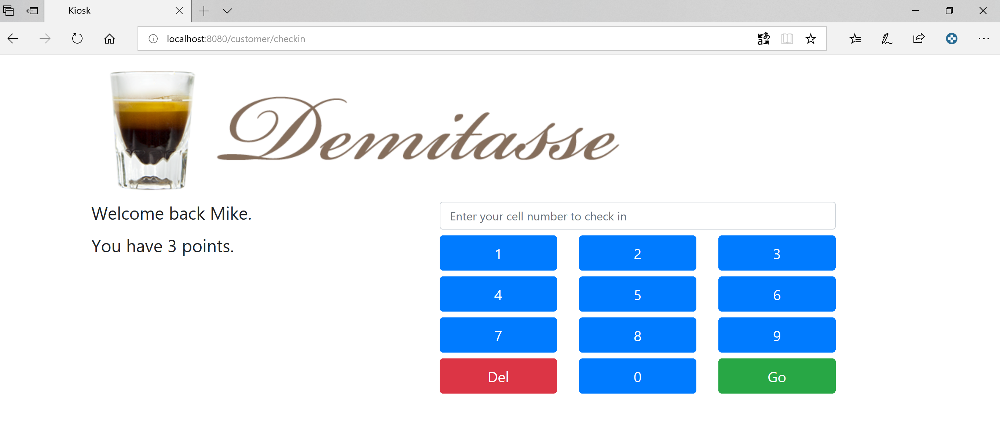

[[create-mvc]]
== Design Web Layer

In this Lab we will look at how design our Web Layer.

=== Step 1: Change The Grails Logo

- Within `images` -> `project` -> use the `demi_logo.png` (this project)
- Move it into your project under - `grails-app` -> `assets` -> `images`
- Now open - `views` -> `layouts` -> `main.gsp`

[source,html]
----
<nav class="navbar navbar-expand-lg navbar-dark navbar-static-top" role="navigation">
    <a class="navbar-brand" href="/#"><asset:image src="grails.svg" alt="Grails Logo"/></a>
----

- Just change the `grails.svg` to `demi_logo.png`

*Exercise (Optional):* change the `favicon` from the grails cup to the one in `projects` -> `cupicon.gif`

=== Step 2: (Demo Form) - Create New Controller

By now you should the hang of it so I will just say:

- `controller` -> Name - `feedback`.
- Now lets add the `view` for that controller -> `files` -> `index.gsp` + `_form.gsp` (this project)
- Move the files to `views` -> `feedback`
- Test that the page is displayed with just a `home` and `submit` button

*Note* - url should be http://localhost:8080/feedback

=== Step 3: (Demo Form) - Populate The Form

It's time to populate the form and have a working controller, this will help us gain knowledge and go forward with our application.

[source,html]
----

    <label for="firstName">
        First Name
    </label>
    <g:textField name="firstName" value="${firstName}"/>

    <label for="comments">
        Comments
    </label>
    <g:textArea name="comments" value="${comments}"/>

    <label for="password">
        Password
    </label>
    <g:passwordField name="password" value="${password}"/>

    <label for="notify">
        Do you want notifications?
    </label>
    <g:checkBox name="notify" value="${notify}"/>

    <label for="gender">
        Gender:
    </label>
    <g:radioGroup name="gender" labels="['Male', 'Female']" values="['M', 'F']" value="${gender}">
        ${it.label} ${it.radio}
    </g:radioGroup>

    <label for="marketing">
        How did you hear about us?
    </label>
    <g:select from="['Internet', 'Friend', 'Other']" name="marketing" value="${marketing}"/>

----

In this form you will see different fields like `checkbox` / `radio` / `select` etc

=== Step 4: Create Your Kiosk View And Form

- In `views` -> `customer` - add the following: `_kioskForm.gsp` and `checkin.gsp`
- If now we open our application we notice that `checkin` is not available

*Question:* Can you say what it's missing from our application in order to render correctly our `checkin` page?

- Open `CustomerController.groovy` (CTRL+Shift+N | and type CustomerController + Hit Enter)
- Define a new `action` -> `checkin`
- Within `images` -> `project` -> use the `banner.png` (this project) and add it to the `assets`
- Re-run the application and browse to http://localhost:8080/customer/checkin

*Web design is finished!*

We can now move on to the Logic Layer of our application.

link:5-Design-Logic-Layer.adoc[Next Lab: Design Logic Layer - Groovy Basics] | link:0-Readme.adoc[Table Of Contents]