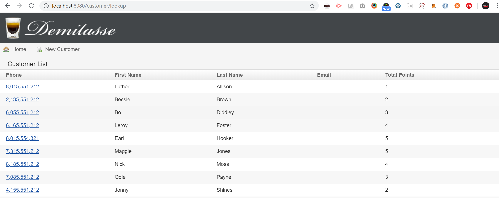

[[create-mvc]]
== Design Logic Layer - Groovy Basics

In this Lab we will learn how to manipulate data.

=== Step 1: List Queries

- Within `files` -> `project` -> use the `lookup.gsp` (this project)
- Move it into your project under - `grails-app` -> `views` -> `customer`
- Open - `CustomerController` - create a new `action` -> `lookup`

*Note:* in `lookup.gsp` you can see how the view is generated after receiving a full list of customers.

[source,groovy]
----
import grails.gorm.transactions.Transactional

@Transactional
class CustomerController {

    static scaffold = Customer

    def lookup() {
        def customer = Customer.list()
        [customerList: customer]
    }

    //def index() { }

    def checkin() {}
}
----

- Open browser at - http://localhost:8080/customer/lookup

- Just to exercise and understand the functionality let's play with some methods and parameters:

[source,groovy]
----
import grails.gorm.transactions.Transactional

@Transactional
class CustomerController {

    static scaffold = Customer

    def lookup() {
        //offset = skip to a specific page, in our example 0 is the first page
        def customer = Customer.list(sort: "lastName", order: "desc", max: 5, offset: 0)

        //there is no method `findAllByLastName` - grails is creating the sql for this query = dynamic finder
        def customer = Customer.findAllByLastName("Foster")
        def customer = Customer.findAllByTotalPoints(5, [sort: "lastName"])

        //same applies with a comparator for a dynamic finder
        def customer = Customer.findAllByLastNameLike("B%")
        def customer = Customer.findAllByTotalPointsGreaterThanEquals(3, [sort: "totalPoints", order: "desc"])

        //you can also combine for more drastic search results
        def customer = Customer.findAllByLastNameLikeAndTotalPointsGreaterThanEquals("B%", 2)

        [customerList: customer]
    }

    //def index() { }

    def checkin() {}
}
----

- Open browser at - http://localhost:8080/customer/lookup

=== Step 2: Advanced CRUD Operations

- Add every `action` within `CustomerController`

- List:
[source,groovy]
----
//uncomment index and make it so it displays max 10 users + pagination
def index() {
    //params will be passed for list and count will be used in order to determine the number of pages
    params.max = 10
    [customerList: Customer.list(params), customerCount: Customer.count()]
}
----

- *Create:*
[source,groovy]
----
def create() {
    [customer: new Customer()]
}
----

- *Save:*
----
def save(Customer customer) {
    customer.save()
    redirect(action: "show", id: customer.id)
}
----

- *Show:*
----
def show(Long id) {
    def customer = Customer.get(id)
    [customer: customer]
}
----

- *Edit:*
----
def update(Long id) {
    def customer = Customer.get(id)
    customer.properties = params
    customer.save(flush: true)
    redirect(action: "show", id: customer.id)
}
----

- *Delete:*
----
def delete(Long id) {
    def customer = Customer.get(id)
    customer.delete(flush: true)
    redirect action: "index"
}
----

*Managing Data is finished!*

We can now move on to Manage data with GORM of our application.

link:6-Manage-Data-With-GORM.adoc[Next Lab: Manage Data With GORM] | link:0-Readme.adoc[Table Of Contents]