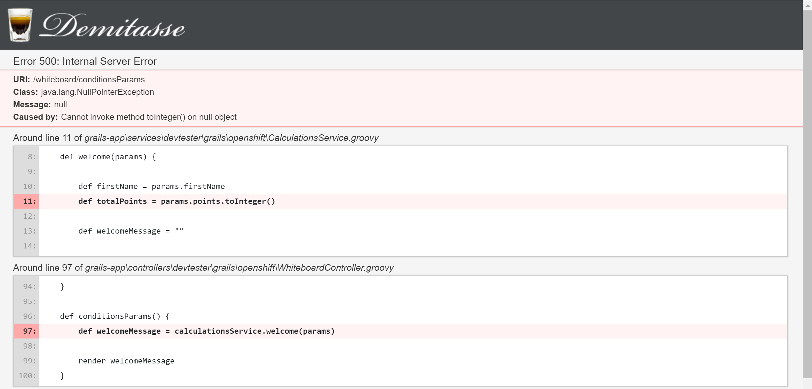

[[create-mvc]]
== Design Logic Layer - Groovy Basics

In this Lab we will learn some key aspects of the `Groovy programming language`.

=== Step 1: Variables

- First thing is to create a `WhiteboardController`

[source,groovy]
----
class WhiteboardController {

    //def index() {}

    def variables() {

        /** Groovy can figure out what type of variable you are def
         * if your variable has no quotes = number
         * if it has quotes = string
         * if you are using a function like date it will assume it's a date
         */

        def myTotal = 1
        render("Total: " + myTotal)
        render(" " + myTotal.class + " ")

        def firstName = "Mike"
        render(" Name: " + firstName)
        render(" " + firstName.class + " ")

        def today = new Date()
        render(" Today is: " + today)
        render(" " + today.class + " ")

        /** Before hitting refresh to see the results
         * guess what type of variable has "whatVariable"
         */

        def whatVariable = 1.0
        render(" Guess the type: " + whatVariable)
        render(" " + whatVariable.class + " ")

    }
}
----

=== Step 2: Strings

[source,groovy]
----
def strings() {

        /** Some String magic
         *  Different way to concat strings
         *  Check the size of a strings
         *  Make it lowercase
         */

        def first = "Mike"
        def last = "Kelly"

        def input = "SomethiNGTHatHaslowerUPPER"

        def fullName = first + last

        def points = 4

        render "Welcome back " +  " " + first + "." + "You have " + points + " " + "points "

        render " Hey there $first. You already have $points points "

        render " Today is ${new Date()} "
        render " Your full name is: $fullName and has: ${fullName.size()} characters "

        render " Everything to lower: ${input.toLowerCase()} "

    }
----

=== Step 2: Conditions

[source,groovy]
----
    def conditions() {

        /** Example of condition in groovy
         *  As you can see it accepts ranges "2..3"
         */

        def firstName = "Mike"
        def totalPoints = 5
        def welcomeMessage = ""

        switch (totalPoints) {
            case 5:
                welcomeMessage = "Welcome back $firstName, this drink is on us"
                break
            case 4:
                welcomeMessage = "Welcome back $firstName, your next drink is free"
                break
            case 2..3:
                welcomeMessage = "Welcome back $firstName, you have $totalPoints points"
                break
            default:
                welcomeMessage = "Welcome $firstName. Thanks for registering"
        }

        render welcomeMessage
    }
----

=== Step 3: Service

Now to create something more useful like a `service`

- Open the `terminal`

[source,shell]
----
$ grails create-service devtester.grails.openshift.Calculations
----

- Refresh the project if you created it from terminal just to be safe
- Now `CalculationService` should be available

[source,groovy]
----
@Transactional
class CalculationsService {

    def serviceMethod() {

    }
}
----

Just think of this in the same way as a `controller` it will have `actions` with each action performing a different `service`

- Modify our `service` and create a `welcome` service

[source,groovy]
----
@Transactional
class CalculationsService {

    def welcome(params) {

        def firstName = params.firstName
        def totalPoints = params.points.toInteger()

        def welcomeMessage = ""

        switch (totalPoints) {
            case 5:
                welcomeMessage = "Welcome back $firstName, this drink is on us"
                break
            case 4:
                welcomeMessage = "Welcome back $firstName, your next drink is free"
                break
            case 2..3:
                welcomeMessage = "Welcome back $firstName, you have $totalPoints points"
                break
            default:
                welcomeMessage = "Welcome $firstName. Thanks for registering"
        }

    }

}
----

- Making the `controller` to talk with our `service`
- Using the `WhiteboardController`

[source,groovy]
----
    def conditionsParams() {
        //calculatioService using it with lowerCase
        def welcomeMessage = calculationsService.welcome(params)

        render welcomeMessage
    }
----

*Controller Params* - `params` is actually a default variable for any `controller`.

- The most basic way http://localhost:8080/whiteboard/1 - this will populate the params variable and you can take that value by calling `params.id`.
- A more advanced way is using multiple params - http://localhost:8080/whiteboard/conditionsParams?firstName=Sorin&points=2 - in this case you need to use `params.firstName` and `params.points` to get the values sent.
- Now that we have covered what params is for your `welcome` action we just need to tell our `controller` to use `calculationsService`

[source,groovy]
----
class WhiteboardController {

    def calculationsService

    //def index() {}
    ...
}
----

- Open the browser at - http://localhost:8080/whiteboard/conditionsParams

*Oops* - we encounter our first 500 error since we haven't passed any of the two mandatory params for our service.

- To Fix the problem just open `CalculationsService`

[source,groovy]
----
class CalculationsService {

    def welcome(params) {
        //Adding the safe navigation operator - http://groovy-lang.org/operators.html
        def firstName = params?.firstName
        def totalPoints = params.points?.toInteger()
----

- To test that your service now works try - http://localhost:8080/whiteboard/conditionsParams?firstName=Sorin&points=2

*Logic design is finished!*

We can now move on to Manage data with GORM of our application.

link:6-Manage-Data-With-GORM.adoc[Next Lab: Manage Data With GORM] | link:0-Readme.adoc[Table Of Contents]