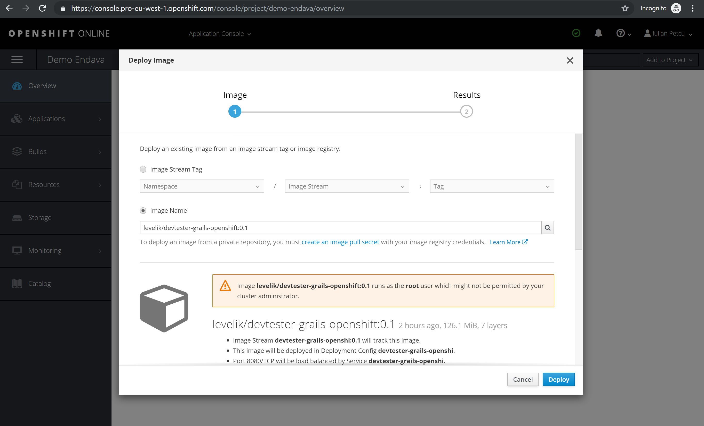
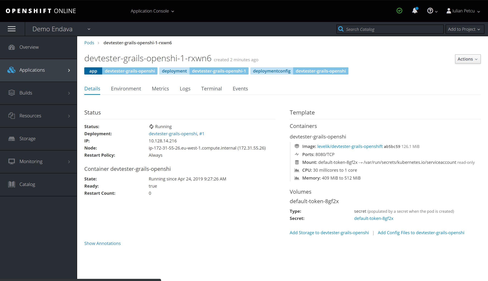
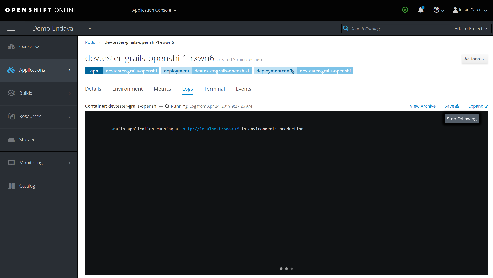
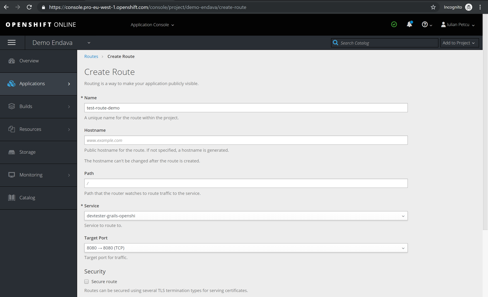
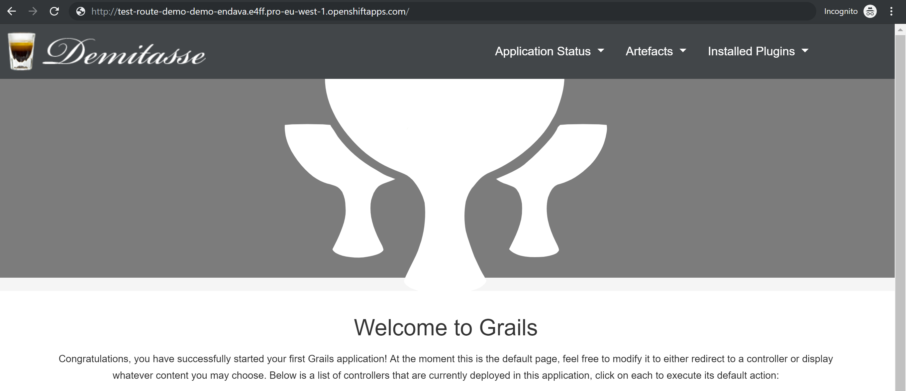

[[lab-9]]
== Deploy Application To OpenShift

In this Lab we will create a docker image that can be used locally or in any cloud environment.

=== Step 1: Login and Create a Project

- Open browser at - https://manage.openshift.com/.
- Login and hit the `Open Web Console`.
- Click on `Create Project` and give it a `name`.
- Select `Deploy Image` - paste the docker image name including its version.

- We can go and see the logs for our `container` due note that in OpenShift they are called `pods`.

- Click on `Applications` -> `Pods` -> select desired `pod` -> hit `logs`.

- Now if you try the http://localhost:8080 it doesn't work, for this we need to create a `Route`.
- Click on `Applications` -> `Routes` -> `Create Route`.

- A link will be displayed and press it.

*Congrats you have finished all labs!*

You should have the app deployed and running the same as:
 **http://grails-devtester-devtester-grails.1d35.starter-us-east-1.openshiftapps.com/customer/checkin

link:10-Next-Steps.adoc[Next Lab: Next Steps] | link:0-Readme.adoc[Table Of Contents]
