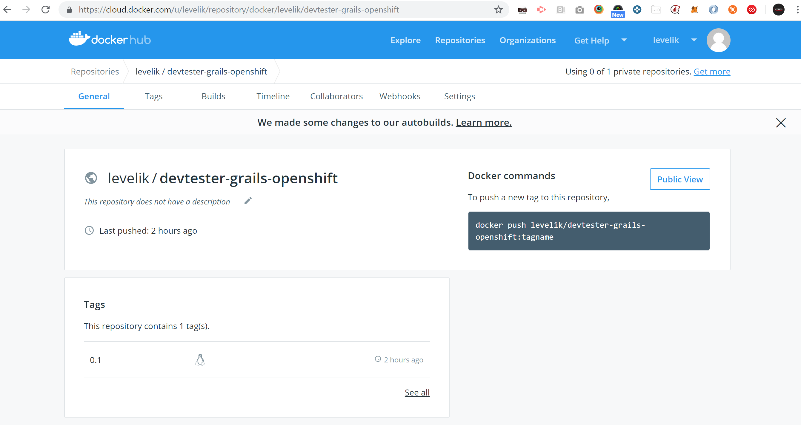

[[create-mvc]]
== Run Application Within Docker

In this Lab we will create a docker image that can be used locally or in any cloud environment.

=== Step 1: Using Gradle Docker Plugin

There are several ways in how we can use docker to create a container with our app that can run on any env.
We will focus on using a plugin since it's much easier to integrate with `gradle`

- Open `build.gradle` - note that you have a comment to change an alias

[source, groovy]
----
dependencies {
    classpath "com.bmuschko:gradle-docker-plugin:3.5.0"
}

//simply comment out the line with war since we are generating a jar file
//apply plugin:"war"

apply plugin:"com.bmuschko.docker-remote-api"

//Paste it at the bottom of the file
import com.bmuschko.gradle.docker.tasks.image.Dockerfile
import com.bmuschko.gradle.docker.tasks.image.DockerBuildImage

ext {
    //levelik is my docker hub alias - please use yours :)
    dockerTag = "levelik/${project.name}:${project.version}".toLowerCase()
    dockerBuildDir = mkdir("${buildDir}/docker")
}

task prepareDocker(type: Copy, dependsOn: assemble) {
    description = 'Copy files from src/main/docker and application jar to Docker temporal build directory'
    group = 'Docker'

    from 'src/main/docker'
    from project.jar

    into dockerBuildDir
}
task createDockerfile(type: Dockerfile, dependsOn: prepareDocker) {
    description = 'Create a Dockerfile file'
    group = 'Docker'

    destFile = project.file("${dockerBuildDir}/Dockerfile")

    from 'openjdk:8-jdk-alpine'
    maintainer 'Iulian Petcu "iulian.petcu@endava.com"'

    exposePort 8080

    workingDir '/app'

    copyFile jar.archiveName, 'application.jar'
    copyFile 'app-entrypoint.sh', 'app-entrypoint.sh'
    runCommand 'chmod +x app-entrypoint.sh'

    entryPoint '/app/app-entrypoint.sh'
}

task buildImage(type: DockerBuildImage, dependsOn: createDockerfile) {
    description = 'Create Docker image to run the Grails application'
    group = 'Docker'

    inputDir = file(dockerBuildDir)
    tag = dockerTag
}
----

- From the above script you need to add also a `app-entrypoint.sh` that can be found in `files` (this project)
- It should stay under `src` -> `main` -> `docker`
- Since we are using `windows` this file will run under `linux` so chmod can't use `windows` files - http://dos2unix.sourceforge.net/

- Before we can run please update the `production db` -> `application.yaml` -> `dbCreate` same as for `development` (OpenShift trial has limited resources)

- Bring up a `terminal` / `cmd` - C:\Users\level\IdeaProjects\devtester-grails-openshift>.\gradlew buildImage

[source, shell]
----
> Task :assetCompile
Finished Precompiling Assets

> Task :compileGroovy
Could not open/create prefs root node Software\JavaSoft\Prefs at root 0x80000002. Windows RegCreateKeyEx(...) returned error code 5.

> Task :buildImage
Building image using context 'C:\Users\level\IdeaProjects\devtester-grails-openshift\build\docker'.
Using tag 'levelik/devtester-grails-openshift:0.1' for image.

Step 1/8 : FROM openjdk:8-jdk-alpine

---> 3675b9f543c5
Step 2/8 : MAINTAINER Iulian Petcu "iulian.petcu@endava.com"

---> Using cache
---> b798e863a344
Step 3/8 : EXPOSE 8080

---> Using cache
---> fb983bcf3059
Step 4/8 : WORKDIR /app

---> Using cache
---> e8ff2192c51e
Step 5/8 : COPY devtester-grails-openshift-0.1.jar application.jar

---> fd0e884bec08
Step 6/8 : COPY app-entrypoint.sh app-entrypoint.sh

---> 97c884403feb
Step 7/8 : RUN chmod +x app-entrypoint.sh

---> Running in 39c2b2104993
Removing intermediate container 39c2b2104993
---> 3c76d49cb212
Step 8/8 : ENTRYPOINT ["/app/app-entrypoint.sh"]

---> Running in 0b9d82b569a3
Removing intermediate container 0b9d82b569a3
---> 9d3fe992aea6
Successfully built 9d3fe992aea6
Successfully tagged levelik/devtester-grails-openshift:0.1

> Task :buildImage
Created image with ID '9d3fe992aea6'.

BUILD SUCCESSFUL in 41s
10 actionable tasks: 10 executed
----

*Local Run* - `docker run --name demo-grails --rm -p 8080:8080 -it levelik/devtester-grails-openshift:0.1`

*Cloud Run:*

- `docker login` - use your credentials to login
- `docker push levelik/devtester-grails-openshift:0.1`

Some useful docker commands:

1. Cleanup everything - `docker system prune -a`
2. Entering a running container - `docker exec -it demo-grais /bin/bash`
3. View active containers - `docker ps`
4. Stop a container - `docker stop ${name} or ${containerId}` - everywhere you can specify the `name` or `id`

[source, shell]
----
PS C:\Users\level> docker ps
CONTAINER ID        IMAGE                                    COMMAND                  CREATED             STATUS              PORTS                    NAMES
03434b1d4dcd        levelik/devtester-grails-openshift:0.1   "/app/app-entrypoint…"   3 seconds ago       Up 1 second         0.0.0.0:8080->8080/tcp   demo-grails
PS C:\Users\level>
----

*My part with the App is finished!*

We can now move on to xxx of our application.

link:8-Run-Application-Within-Docker.adoc[Next Lab: Run Application Within Docker Containers] | link:0-Readme.adoc[Table Of Contents]
